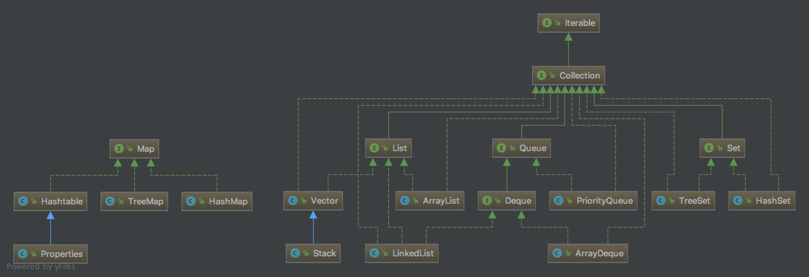

# 数据结构与算法
## 数据结构

- 列表：MyArrayList、MyLinkedList
- 队列：MyArrayQueue、MyLinkedQueue
- 栈：MyArrayStack、MyLinkedStack
- 堆(优先级队列)：MyHeap（array）
- 散列：MyHashMap(Node[] + 链地址法)
- 树：MyBinarySearchTree
- 图：MyGraph

## 算法
### 排序

| 算法类型 | 算法名称 | 最优时间复杂度 | 平均时间复杂度 | 最差时间复杂度 | 空间复杂度 | 备注 |
| -------- | -------- | -------------- | -------------- | -------------- | ---------- | ---- |
| 交换排序  | 冒泡排序  |                |                |                |            |      |
|          | 快速排序  |                |                |                |            |      |
| 选择排序  | 简单选择  |                |                |                |            |      |
|          | 堆排序    |                |                |                |            |      |
| 插入排序  | 直接插入  |                |                |                |            |      |
|          | 希尔排序  |                |                |                |            |      |
| 归并排序  | 归并排序  |                |                |                |            |      |
| 基数排序  | 基数排序  |                |                |                |            |      |